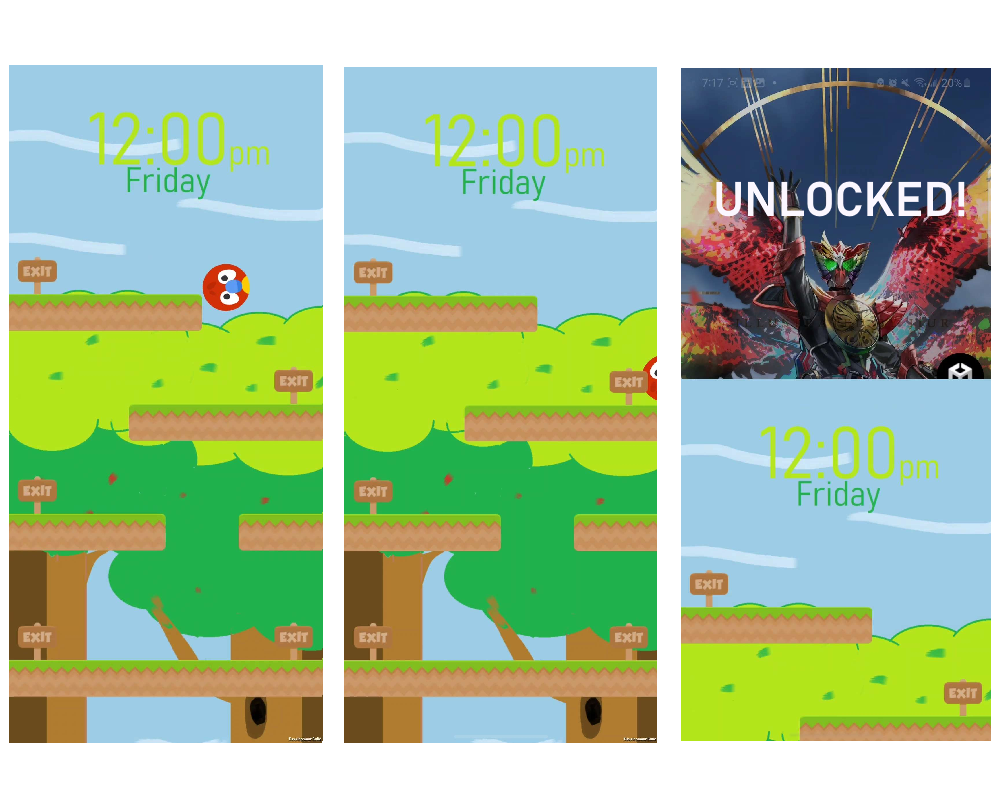

# GuideBall

The guide ball unlocking method introduced innovative concepts like the shake pattern, where users moved the phone in specific patterns, and vocal cues, allowing users to hum a tune for device access. Additional concepts included angle unlock, requiring physical manipulation for access, and the ladder, a gamified unlocking approach. The locking mechanism was refined with a tile-based approach, significantly enhancing security. The user interface received meticulous attention, with a Unity script and illustrations improving visual appeal. This innovative approach revolutionized device interaction and authentication.

## Contributors

- Kai Ho Chak
- Htet Myet Aung Naing
- Kusumpreet Kaur Heer
- Logan Perry-Din

## Installation

1. Download the APK on any Android device from this link
[THIS LINK](https://drive.google.com/file/d/1Fj-x7-zV8O3n2ztfzucaY4mQzx7htcI2/view?usp=sharing)
2. Install the APK and begin playing!

OR Follow these simple steps to run the game on your local machine:

1. Clone the repository to your computer
2. Open Unity
3. Ensure you have Unity 2022.3.10f1 installed
4. Click “Open” or “Load Project” in the Unity Hub.
5. Open your cloned repository
6. Connect an Android device with developer mode via USB
7. Build and run the project in unity

## The unlocking 

###  Controls
Tilt your phone to move the ball!
###  How to unlock:
Move the ball to the correct exit

## Resources:
Game sprites:
https://kenney.itch.io/kenney-game-assets-1
