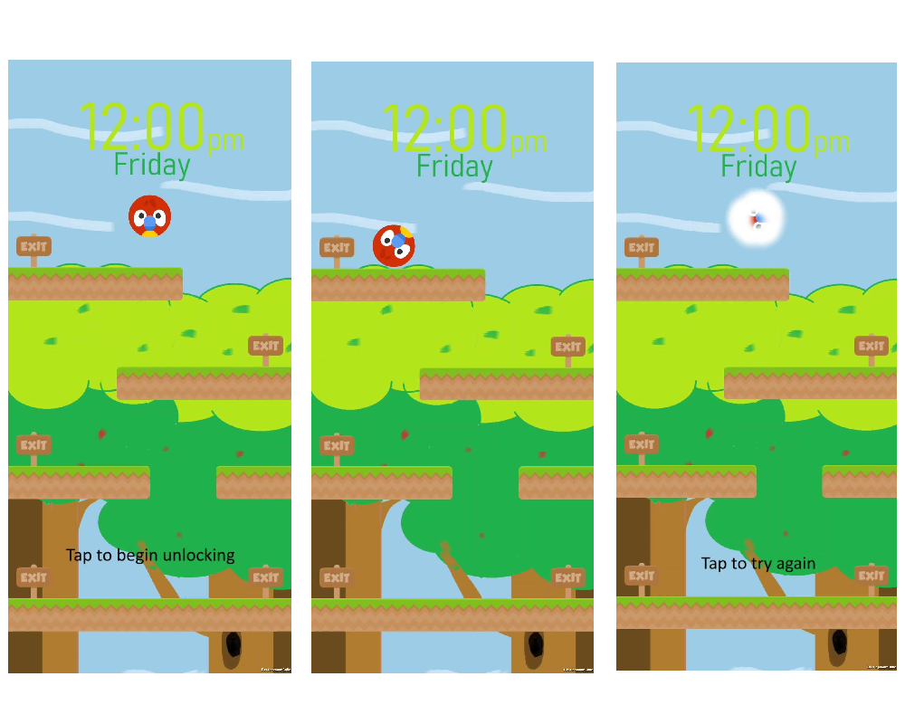

# GuideBall

## Contributors

- Kai Ho Chak
- Htet Myet Aung Naing
- Kusumpreet Kaur Heer
- Logan Perry-Din

## Installation

Getting started with The Clicker Game is a breeze. 

1. Download the APK on any Android device from this link
[THIS LINK]([https://kaihochak.github.io/clicker](https://drive.google.com/file/d/1Fj-x7-zV8O3n2ztfzucaY4mQzx7htcI2/view?usp=sharing))
2. Install the APK and begin playing!

OR Follow these simple steps to run the game on your local machine:

1. Clone the repository to your computer
2. Open Unity
3. Ensure you have Unity
4. Click “Open” or “Load Project” in the Unity Hub.
5. Open your cloned repository
6. Connect an Android device with developer mode via USB
7. Build and run the project in unity

## The unlocking 

###  Controls
Tilt your phone to move the ball!
###How to unlock:
Move the ball to the correct exit

## Resources:
Game sprites:
https://kenney.itch.io/kenney-game-assets-1
